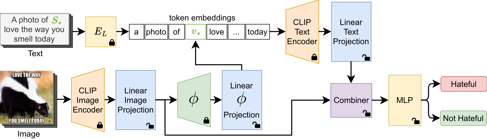

# ISSUES (ICCVW 2023)

### Mapping Memes to Words for Multimodal Hateful Meme Classification

[](https://github.com/miccunifi/ISSUES)

This is the **official repository** of the paper "*Mapp**I**ng Meme**S** to Word**S** for M**U**ltimodal Hateful M**E**me Cla**S**sification*" (**ISSUES**).

## Overview

### Abstract

Multimodal image-text memes are prevalent on the internet, serving as a unique form of communication that combines visual and textual elements to convey humor, ideas, or emotions. However, some memes take a malicious turn, promoting hateful content and perpetuating discrimination. Detecting hateful memes within this multimodal context is a challenging task that requires understanding the intertwined meaning of text and images. In this work, we address this issue by proposing a novel approach named ISSUES for multimodal hateful meme classification. ISSUES leverages a pre-trained CLIP vision-language model and the textual inversion technique to effectively capture the multimodal semantic content of the memes. The experiments show that our method achieves state-of-the-art results on the Hateful Memes Challenge and HarMeme datasets.



Overview of the proposed approach. We disentangle CLIP common embedding space via linear projections. We employ textual inversion to make the textual representation multimodal. We fuse the textual and visual features with a [Combiner](https://github.com/ABaldrati/CLIP4Cir) architecture. $E_{L}$ represents the CLIP embedding lookup layer. $\phi$ indicates the [SEARLE](https://github.com/miccunifi/SEARLE) textual inversion network.

<details>
<summary><h2>Getting Started</h2></summary>

We recommend using the [**Anaconda**](https://www.anaconda.com/) package manager to avoid dependency/reproducibility
problems.
For Linux systems, you can find a conda installation
guide [here](https://docs.conda.io/projects/conda/en/latest/user-guide/install/linux.html).

### Installation

1. Clone the repository

```sh
git clone https://github.com/miccunifi/ISSUES.git
```

2. Install Python dependencies

Navigate to the root folder of the repository and use the command:
```sh
conda config --add channels conda-forge
conda create -n issues -y python=3.9.16
conda activate issues
conda install pytorch==1.12.1 torchvision==0.13.1 torchaudio==0.12.1 cudatoolkit=11.3 -c pytorch
conda install --file requirements.txt
pip install git+https://github.com/openai/CLIP.git
```

3. Log in to your WandB account
```sh
wandb login
```

## Datasets
We do not hold rights to the original HMC and HarMeme datasets. 
To download the full original datasets use the following links:

- HMC **[[link](https://hatefulmemeschallenge.com/)]** - Contains **12.140** memes
- HarMeme **[[link](https://github.com/di-dimitrov/mmf/tree/master/data/datasets/memes/defaults/images)]** - Contains **3.544** memes


### Data Preparation
Download the files in the [release](https://github.com/miccunifi/ISSUES/releases/tag/latest) and place the `resources` folder in the root folder:

<pre>
project_base_path
└─── <b>resources</b>
  ...
└─── src
  | combiner.py
  | datasets.py
  | engine.py
  ...

...
</pre>

Ensure the HMC and HarMeme datasets match the following structure:

<pre>
project_base_path
└─── resources
  └─── datasets
    └─── harmeme
      └─── clip_embds
          | test_no-proj_output.pt
          | train_no-proj_output.pt
          | val_no-proj_output.pt

      └─── <b>img
          | covid_memes_2.png
          | covid_memes_3.png
          | covid_memes_4.png
          ....</b>

      └─── labels
          | info.csv

    └─── hmc
      └─── clip_embds
          | dev_seen_no-proj_output.pt
          | dev_unseen_no-proj_output.pt
          | test_seen_no-proj_output.pt
          | test_unseen_no-proj_output.pt
          | train_no-proj_output.pt

      └─── <b>img
          | 01235.png
          | 01236.png
          | 01243.png
          ....</b>
        
      └─── labels
          | info.csv
  ...
  
└─── src
  | combiner.py
  | datasets.py
  | engine.py
  ...

...
</pre>

</details>

<details>
<summary><h2>Usage</h2></summary>

### Pre-trained models

We provide the pre-trained models in the [release](https://github.com/miccunifi/ISSUES/releases/tag/latest). Ensure that the checkpoints match the following structure:

<pre>
project_base_path
└─── resources
  └─── datasets
      ...
  └─── <b>pretrained_models
      | hmc_text-inv-comb_best.ckpt
      | harmeme_text-inv-comb_best.ckpt</b>
      
  └─── pretrained_weights
      ...
  
└─── src
  | combiner.py
  | datasets.py
  | engine.py
  ...

...
</pre>

### Training and Testing
We provide scripts for training and testing our approach on the HMC and HarMeme datasets.

<pre>
project_base_path
└─── resources
  ...
  
└─── src
  ...

<b>
run_harmeme_text-inv-comb.sh
run_hmc_text-inv-comb.sh
</b>

...
</pre>

To use a script, navigate to the root folder and use the following commands:

```shell
chmod +x <filename>.sh
./<filename>.sh
```
where:
- ```<filename> = run_harmeme_text-inv-comb``` is related to the HarMeme dataset
- ```<filename> = run_hmc_text-inv-comb``` is related to the HMC dataset

For <b>training</b> the model from scratch and then evaluating its performance, disable the ```--reproduce``` flag of the script.

For <b>testing</b> the pre-trained models and reproducing our results, enable the ```--reproduce``` flag of the script.

### Arguments
In the following, we describe each argument of the scripts.

#### Experiments
- ```dataset``` - dataset name: [**hmc** or **harmeme**]
- ```num_mapping_layers``` - number of projection layers to map CLIP features in a task-oriented latent space
- ```num_pre_output_layers``` - number of MLP hidden layers for performing the final classification
- ```max_epochs``` - maximum number of epochs
- ```lr``` - learning rate
- ```batch_size``` - batch size
- ```fast_process``` - flag to indicate whether to use pre-computed CLIP features as the input of the model instead of 
                        computing them during the training process
- ```name``` - name of the model
- ```pretrained_model``` - name of the checkpoint of the pretrained model in the 'pretrained_models' folder
- ```reproduce``` - flag to indicate whether to perform the training process followed by the evaluation phase (False) or directly evaluate a pre-trained model on the test data (True)

#### General
- ```map_dim``` - output dimension of the projected feature vectors
- ```fusion``` - fusion method between the textual and visual modalities (when applicable): [**concat** or **align**]
- ```pretrained_proj_weights``` - flag to indicate whether to use pre-trained projection weights (when applicable)
- ```freeze_proj_layers``` - flag to indicate whether to freeze the pre-trained weights


#### Combiner Architecture
- ```comb_proj``` - flag to indicate whether to project the input features of the Combiner 
- ```comb_fusion``` - fusion method to use to combine the input features of the Combiner
- ```convex_tensor``` - flag to indicate whether to compute a tensor or a scalar as the output of the convex combination

#### Textual Inversion Architecture
- ```text_inv_proj``` - flag to indicate whether to use CLIP textual encoder projection 
- ```phi_inv_proj``` - flag to indicate whether to project the output of phi network
- ```post_inv_proj``` - flag to indicate whether to project the CLIP textual encoder output features
- ```enh_text``` - flag to indicate whether to use a prompt with only the pseudo-word or concatenate the meme text
- ```phi_freeze``` - flag to indicate whether to freeze the pre-trained phi network 

</details>

## Authors

* [**Giovanni Burbi**](https://github.com/GiovanniBurbi)
* [**Alberto Baldrati**](https://scholar.google.it/citations?hl=en&user=I1jaZecAAAAJ)
* [**Lorenzo Agnolucci**](https://scholar.google.com/citations?user=hsCt4ZAAAAAJ&hl=en)
* [**Marco Bertini**](https://scholar.google.it/citations?user=SBm9ZpYAAAAJ&hl=en)
* [**Alberto Del Bimbo**](https://scholar.google.com/citations?user=bf2ZrFcAAAAJ&hl=en)

## Acknowledgements
Our code is based on **SEARLE** [](https://github.com/miccunifi/SEARLE) and **Hate-CLIPper**[](https://github.com/gokulkarthik/hateclipper).

This work was partially supported by the European Commission under European Horizon 2020 Programme, grant number
101004545 - ReInHerit.

